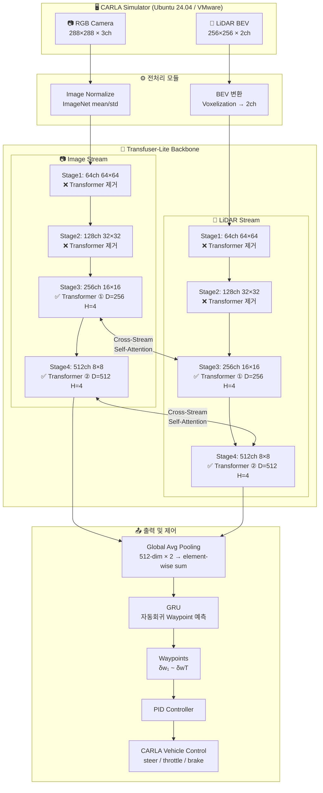
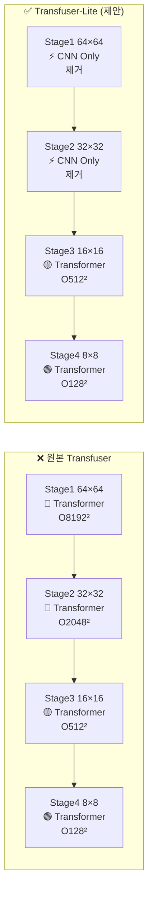
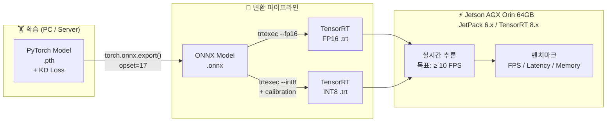
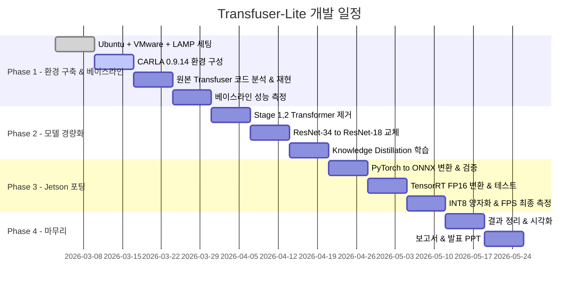

# 🚗 Transfuser-Lite
### Lightweight Transfuser with TensorRT Optimization on Jetson AGX Orin

> **캡스톤 디자인 | 임베디드소프트웨어학과 2301425 신민서**  
> Transfuser 모델 경량화 및 Jetson AGX Orin 기반 실시간 자율주행 추론 시스템 구현

---

## 📌 프로젝트 개요

본 프로젝트는 카메라와 LiDAR를 융합하는 Transformer 기반 자율주행 모델인 **Transfuser** (CVPR 2021 / PAMI 2023)를 경량화하여, **Jetson AGX Orin 64GB** 엣지 디바이스에서 실시간 추론이 가능한 시스템을 구현하는 것을 목표로 합니다.

---

## 🔍 원본 Transfuser 구조 분석 (논문 기반)

### 논문 원본 아키텍처 (CVPR 2021)

논문에서 Image Encoder는 ResNet-34, LiDAR BEV Encoder는 ResNet-18을 사용하며, 기본 설정으로 해상도당 Transformer 1개씩 총 4개를 사용하고 각 Transformer마다 Attention Head는 4개입니다. 4개의 Transformer는 각각 64×64, 32×32, 16×16, 8×8 해상도의 feature map에 배치됩니다.

```
Image Encoder (ImageCNN):   ResNet-34  ← pretrained ImageNet
LiDAR Encoder (LidarEncoder): ResNet-18  ← trained from scratch, 2ch input

[Dual Stream Feature Extraction + Fusion]

Stage 1: 64ch  Feature Map (64×64)  →  Transformer Block ① (D=64,  Heads=4)
Stage 2: 128ch Feature Map (32×32)  →  Transformer Block ② (D=128, Heads=4)
Stage 3: 256ch Feature Map (16×16)  →  Transformer Block ③ (D=256, Heads=4)
Stage 4: 512ch Feature Map ( 8×8)   →  Transformer Block ④ (D=512, Heads=4)

각 Transformer: [Camera Feature + LiDAR Feature] → concat → Self-Attention → split
최종: 512-dim 벡터 (element-wise sum) → MLP → GRU → Waypoint 예측
```

### ⚠️ 임베디드 배포가 어려운 진짜 이유

원본 Transfuser의 임베디드 배포 병목은 **Transformer 구조**에 있습니다.

**① Self-Attention의 O(n²) 복잡도 문제**

각 Transformer Block은 두 스트림의 Feature Map을 Flatten하여 concat한 뒤 Self-Attention을 수행합니다.
해상도별 실제 시퀀스 길이는 다음과 같습니다:

```
Stage 1: 64×64 = 4,096 tokens × 2 streams = 8,192 tokens  →  O(8,192²) ← 병목 ⚠️
Stage 2: 32×32 = 1,024 tokens × 2 streams = 2,048 tokens  →  O(2,048²)
Stage 3: 16×16 =   256 tokens × 2 streams =   512 tokens  →  O(512²)
Stage 4:  8×8  =    64 tokens × 2 streams =   128 tokens  →  O(128²)   ← 가벼움 ✅
```

Stage 1에서의 Attention 연산량이 Stage 4 대비 약 **4,096배** 더 많습니다.

**② 4회 반복되는 Fusion 비용**

모든 ResNet 스테이지마다 Fusion이 발생하므로, 추론 1회당 Transformer가 **총 4번** 실행됩니다.
TensorRT 최적화에서도 Attention의 동적 텐서 연산은 최적화 효율이 낮습니다.

**③ 듀얼 스트림의 병렬 처리 한계**

Camera와 LiDAR 스트림이 독립적으로 작동하면서 매 스테이지마다 서로 정보를 교환하는 구조로,
순수 병렬화가 어렵고 엣지 디바이스의 메모리 대역폭에 부담을 줍니다.

---

## 🎯 제안 방법: Transfuser-Lite

### 핵심 경량화 전략

| # | 경량화 포인트 | 원본 | 제안 | 근거 |
|:--|:------------|:----:|:----:|:-----|
| ① | **저해상도 Transformer만 유지** | 4개 (Stage 1~4) | **2개 (Stage 3~4만 유지)** | Stage 1,2가 전체 연산의 대부분 차지 |
| ② | **Image Encoder 경량화** | ResNet-34 | **ResNet-18** | LiDAR는 이미 ResNet-18, 균형 맞춤 |
| ③ | **Attention Head 유지** | 4 (논문 기본값) | **4 유지** | 이미 최소값, 줄이면 성능 손실 과다 |
| ④ | **Knowledge Distillation** | - | **원본→Lite 증류** | 경량화로 인한 성능 손실 보완 |

> **핵심 주장:** Stage 1, 2의 고비용 Attention을 제거하고 의미있는 고수준 Feature만 Fusion하여,
> 성능 손실을 최소화하면서 실시간 임베디드 배포를 가능하게 한다.

---

## 🏗️ 시스템 아키텍처

### 전체 파이프라인



---

### 원본 vs Lite 구조 비교



---

### 최적화 및 배포 파이프라인



---

## 📊 기대 성능 비교

| 모델 | Transformer 수 | Image Backbone | 연산량 (GFLOPs) | Driving Score ↑ | FPS (Jetson TRT FP16) ↑ |
|:-----|:--------------:|:--------------:|:---------------:|:--------------:|:----------------------:|
| Transfuser (원본) | 4개 (Stage 1~4) | ResNet-34 | baseline | baseline | ❌ 불가 |
| Transfuser-Lite (제안) | 2개 (Stage 3~4) | ResNet-18 | 목표: ~40% 감소 | 목표: -5% 이내 | ✅ ≥ 10 FPS 목표 |

> 실험 진행 후 결과 업데이트 예정

---

## 🛠️ 기술 스택

| 분류 | 내용 |
|:-----|:-----|
| 개발 환경 | Ubuntu 24.04 (VMware) + CARLA 0.9.14 |
| 학습 프레임워크 | PyTorch 2.x + CUDA 12.x |
| 원본 모델 | [autonomousvision/transfuser](https://github.com/autonomousvision/transfuser) |
| 경량화 | ResNet-18 (torchvision), Transformer Block 선택적 제거, Knowledge Distillation |
| 모델 변환 | torch.onnx.export → TensorRT trtexec |
| 임베딩 타겟 | Jetson AGX Orin 64GB (JetPack 6.x, TensorRT 8.x) |
| 시뮬레이터 | CARLA 0.9.14 Python API + OpenCV |

---

## 📁 프로젝트 구조

```
transfuser-lite/
│
├── README.md
├── requirements.txt
│
├── config/
│   └── transfuser_lite.yaml        # 모델 하이퍼파라미터 설정
│
├── model/
│   ├── transfuser_original.py      # 원본 Transfuser (CVPR 2021 기반)
│   ├── transfuser_lite.py          # 경량화 모델 (Stage 3,4 Transformer만 유지)
│   └── components/
│       ├── encoder.py              # ResNet-18/34 기반 인코더
│       └── transformer_fusion.py  # Stage별 Self-Attention Fusion 모듈
│
├── train/
│   ├── train.py                    # 학습 스크립트 (KD Loss 포함)
│   ├── dataloader.py               # CARLA 데이터셋 로더
│   └── loss.py                     # Waypoint Loss + KD Loss
│
├── export/
│   ├── export_onnx.py              # PyTorch → ONNX 변환
│   └── export_tensorrt.py          # ONNX → TensorRT FP16/INT8 변환
│
├── jetson/
│   ├── infer_trt.py                # Jetson TensorRT 추론 스크립트
│   └── benchmark.py               # FPS / Latency / Memory 벤치마크
│
├── eval/
│   ├── carla_eval.py               # CARLA 시뮬레이터 평가
│   └── metrics.py                  # Driving Score, Route Completion, Infraction
│
└── results/
    ├── figures/                    # 성능 비교 그래프
    └── logs/                       # 실험 로그
```

---

## 🗓️ 개발 로드맵



### 체크리스트

**Phase 1 — 환경 구축 & 베이스라인 재현 (1~4주)**
- [x] Ubuntu 24.04 + VMware 가상환경 세팅
- [x] LAMP 스택 설치
- [ ] CARLA 0.9.14 설치 및 환경 구성
- [ ] 원본 Transfuser 코드 분석 및 재현 (CVPR 2021 branch)
- [ ] 베이스라인 성능 측정 (Driving Score, Infraction Rate, FPS 기록)

**Phase 2 — 모델 경량화 (5~7주)**
- [ ] Stage 1, 2 Transformer Block 제거 (핵심 경량화)
- [ ] Image Encoder ResNet-34 → ResNet-18 교체
- [ ] Knowledge Distillation: 원본 모델(Teacher) → Lite 모델(Student)
- [ ] CARLA에서 경량화 모델 성능 재측정 및 원본 대비 비교

**Phase 3 — Jetson AGX Orin 포팅 (8~10주)**
- [ ] PyTorch → ONNX 변환 및 출력값 검증
- [ ] TensorRT FP16 변환 및 Jetson 추론 테스트
- [ ] INT8 Calibration 및 FPS 최종 측정
- [ ] FPS / Latency / GPU Memory 사용량 비교 분석

**Phase 4 — 마무리 (11~12주)**
- [ ] 결과 정리 및 시각화 (FPS 그래프, CARLA 주행 영상 녹화)
- [ ] 최종 보고서 작성
- [ ] 발표 PPT 제작

---

## ⚙️ 설치 및 실행

### 1. 환경 설치

```bash
# 원본 Transfuser 클론
git clone https://github.com/autonomousvision/transfuser
cd transfuser

# Python 의존성 설치
pip install -r requirements.txt
```

### 2. 원본 Transfuser 베이스라인

```bash
# 학습
python train/train.py --model original --config config/transfuser_lite.yaml

# CARLA 평가
python eval/carla_eval.py --model original --checkpoint checkpoints/original_best.pth
```

### 3. Transfuser-Lite 학습 (Knowledge Distillation)

```bash
# Teacher: 원본 / Student: Lite
python train/train.py \
  --model lite \
  --teacher_ckpt checkpoints/original_best.pth \
  --config config/transfuser_lite.yaml
```

### 4. TensorRT 변환 및 Jetson 추론

```bash
# Step 1: ONNX 변환
python export/export_onnx.py --checkpoint checkpoints/lite_best.pth --opset 17

# Step 2: TensorRT FP16 변환 (Jetson에서 실행)
python export/export_tensorrt.py \
  --onnx outputs/transfuser_lite.onnx \
  --precision fp16

# Step 3: FPS / Latency 벤치마크
python jetson/benchmark.py --engine outputs/transfuser_lite_fp16.trt
```

---

## 📚 참고 논문 및 자료

- **TransFuser (CVPR 2021)**: [Multi-Modal Fusion Transformer for End-to-End Autonomous Driving](https://openaccess.thecvf.com/content/CVPR2021/papers/Prakash_Multi-Modal_Fusion_Transformer_for_End-to-End_Autonomous_Driving_CVPR_2021_paper.pdf)
- **TransFuser (PAMI 2023)**: [TransFuser: Imitation with Transformer-Based Sensor Fusion for Autonomous Driving](https://arxiv.org/abs/2205.15997)
- **Official Code**: [autonomousvision/transfuser](https://github.com/autonomousvision/transfuser)
- **CARLA Simulator**: [https://carla.org](https://carla.org)
- **TensorRT**: [https://developer.nvidia.com/tensorrt](https://developer.nvidia.com/tensorrt)
- **Jetson AGX Orin**: [https://developer.nvidia.com/embedded/jetson-agx-orin](https://developer.nvidia.com/embedded/jetson-agx-orin)

---

## 👤 작성자

- **소속**: 임베디드소프트웨어학과 2301425 신민서
- **과목**: 캡스톤 디자인
- **개발 기간**: 2026.03 ~ 06

---
