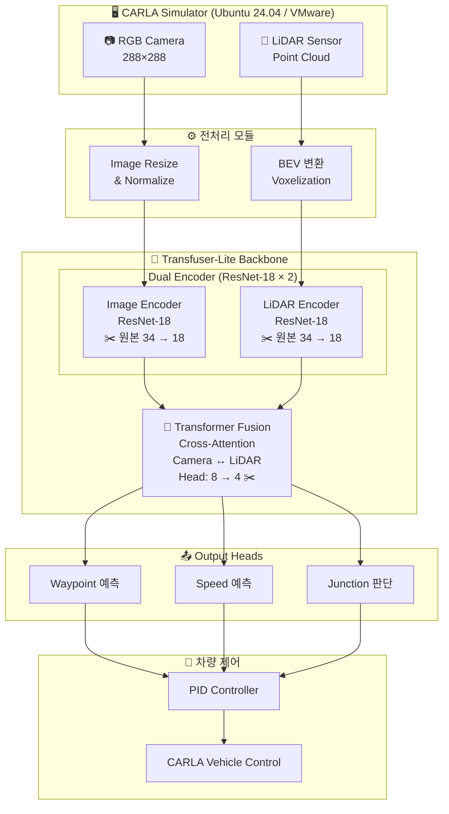
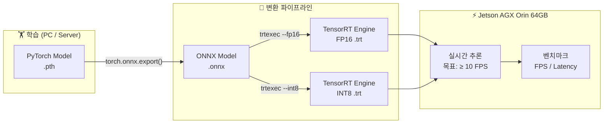
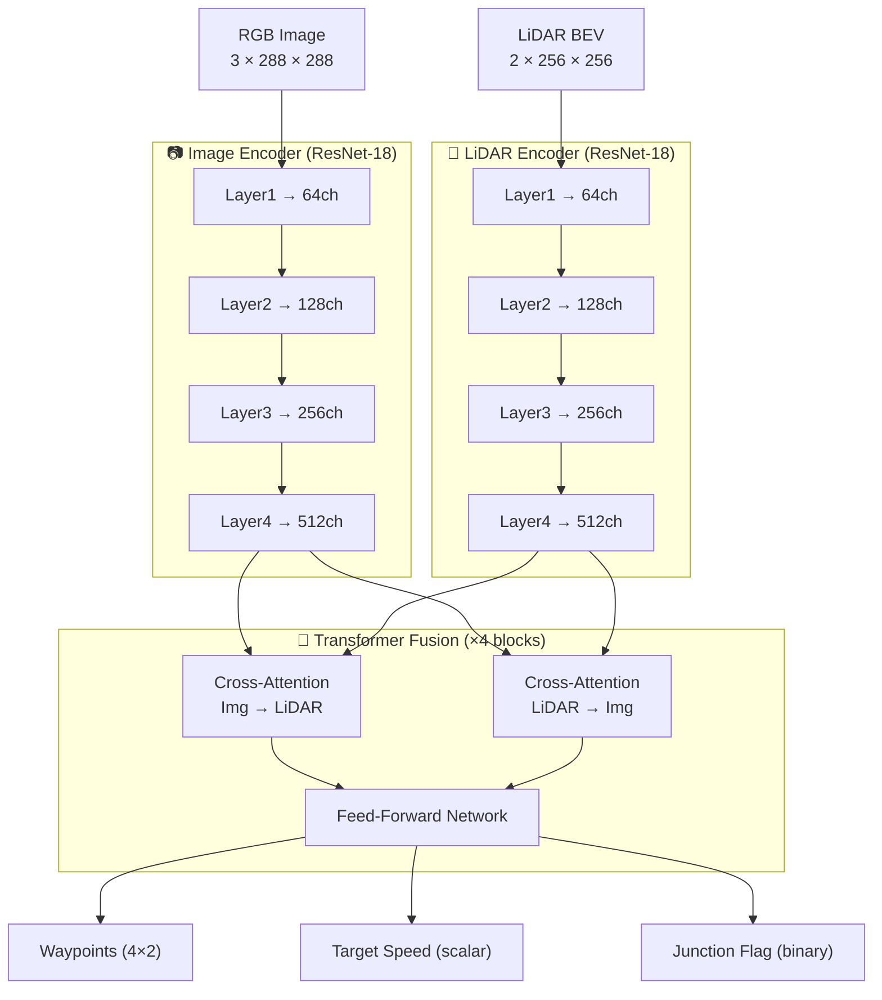
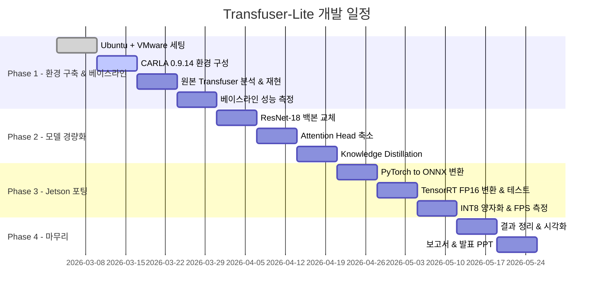

# 🚗 Transfuser-Lite
### Lightweight Transfuser with TensorRT Optimization on Jetson AGX Orin

> **캡스톤 디자인 | 임베디드소프트웨어학과 4학년**  
> Transfuser 모델 경량화 및 Jetson AGX Orin 기반 실시간 자율주행 추론 시스템 구현

---

## 📌 프로젝트 개요

본 프로젝트는 카메라와 LiDAR를 융합하는 Transformer 기반 자율주행 모델인 **Transfuser**를 경량화하여, **Jetson AGX Orin 64GB** 엣지 디바이스에서 실시간 추론이 가능한 시스템을 구현하는 것을 목표로 합니다.

원본 Transfuser는 ResNet-34 기반으로 설계되어 임베디드 환경 배포가 어렵습니다. 본 프로젝트에서는 **ResNet-18 경량 백본 교체**, **Transformer Attention Head 축소**, **TensorRT FP16/INT8 최적화**를 통해 성능을 유지하면서 실시간 배포 가능한 모델을 제안합니다.

---

## 🏗️ 시스템 아키텍처

### 전체 파이프라인



---

### 최적화 및 배포 파이프라인



---

### 모델 구조 상세



---

## 🎯 핵심 기여 (Contributions)

| 구분 | 원본 Transfuser | Transfuser-Lite (제안) |
|:-----|:--------------:|:---------------------:|
| Image Encoder Backbone | ResNet-34 | **ResNet-18** |
| LiDAR Encoder Backbone | ResNet-34 | **ResNet-18** |
| Transformer Attention Heads | 8 | **4** |
| 모델 파라미터 수 | ~100M | **~40M (목표)** |
| CARLA Driving Score | baseline | 목표: -5% 이내 유지 |
| PC 추론 속도 | baseline FPS | 목표: 2~3x 향상 |
| Jetson 추론 (TRT FP16) | ❌ 불가 (메모리 초과) | ✅ **≥ 10 FPS 목표** |

> **핵심 주장:** *성능은 거의 유지하면서 실제 임베디드 배포가 가능하다*

---

## 🛠️ 기술 스택

| 분류 | 내용 |
|:-----|:-----|
| 개발 환경 | Ubuntu 24.04 (VMware) + CARLA 0.9.14 |
| 학습 프레임워크 | PyTorch 2.x + CUDA 12.x |
| 경량화 | torchvision ResNet-18, torch.nn.MultiheadAttention |
| 모델 변환 | torch.onnx → TensorRT trtexec |
| 임베딩 타겟 | Jetson AGX Orin 64GB (JetPack 6.x, TensorRT 8.x) |
| 시뮬레이터 | CARLA Python API + OpenCV |

---

## 📁 프로젝트 구조

```
transfuser-lite/
│
├── README.md
├── requirements.txt
│
├── config/
│   └── transfuser_lite.yaml        # 모델 하이퍼파라미터 설정
│
├── model/
│   ├── transfuser_original.py      # 원본 Transfuser 모델
│   ├── transfuser_lite.py          # 경량화 모델 (ResNet-18 + Head 축소)
│   └── components/
│       ├── encoder.py              # ResNet-18 기반 인코더
│       └── transformer_fusion.py  # Cross-Attention Fusion 모듈
│
├── train/
│   ├── train.py                    # 학습 스크립트
│   ├── dataloader.py               # CARLA 데이터셋 로더
│   └── loss.py                     # 손실 함수
│
├── export/
│   ├── export_onnx.py              # PyTorch → ONNX 변환
│   └── export_tensorrt.py          # ONNX → TensorRT 변환
│
├── jetson/
│   ├── infer_trt.py                # Jetson TensorRT 추론 스크립트
│   └── benchmark.py               # FPS 벤치마크 측정
│
├── eval/
│   ├── carla_eval.py               # CARLA 시뮬레이터 평가
│   └── metrics.py                  # Driving Score, Route Completion 계산
│
└── results/
    ├── figures/                    # 성능 비교 그래프
    └── logs/                       # 실험 로그
```

---

## 🗓️ 개발 로드맵



### 체크리스트

**Phase 1 — 환경 구축 & 베이스라인 재현 (1~4주)**
- [x] Ubuntu 24.04 + VMware 가상환경 세팅
- [x] LAMP 스택 설치
- [ ] CARLA 0.9.14 설치 및 환경 구성
- [ ] 원본 Transfuser 코드 분석 및 재현
- [ ] 베이스라인 성능 측정 (Driving Score, FPS 기록)

**Phase 2 — 모델 경량화 (5~7주)**
- [ ] ResNet-34 → ResNet-18 백본 교체
- [ ] Transformer Attention Head 수 축소 (8 → 4)
- [ ] Knowledge Distillation을 통한 성능 회복 시도
- [ ] CARLA에서 경량화 모델 성능 재측정 및 비교

**Phase 3 — Jetson AGX Orin 포팅 (8~10주)**
- [ ] PyTorch → ONNX 변환 및 검증
- [ ] TensorRT FP16 변환
- [ ] Jetson AGX Orin에서 추론 테스트
- [ ] INT8 양자화 시도 및 FPS 최종 측정

**Phase 4 — 마무리 (11~12주)**
- [ ] 결과 정리 및 시각화 (FPS 그래프, CARLA 주행 영상)
- [ ] 보고서 작성
- [ ] 발표 PPT 제작

---

## ⚙️ 설치 및 실행

### 1. 환경 설치

```bash
pip install -r requirements.txt
```

### 2. 원본 Transfuser 베이스라인

```bash
# 학습
python train/train.py --model original --config config/transfuser_lite.yaml

# CARLA 평가
python eval/carla_eval.py --model original --checkpoint checkpoints/original_best.pth
```

### 3. 경량화 모델 학습

```bash
python train/train.py --model lite --config config/transfuser_lite.yaml
```

### 4. TensorRT 변환 및 Jetson 추론

```bash
# Step 1: ONNX 변환
python export/export_onnx.py --checkpoint checkpoints/lite_best.pth

# Step 2: TensorRT FP16 변환 (Jetson에서 실행)
python export/export_tensorrt.py --onnx outputs/transfuser_lite.onnx --precision fp16

# Step 3: 추론 벤치마크
python jetson/benchmark.py --engine outputs/transfuser_lite_fp16.trt
```

---

## 📊 실험 결과 (업데이트 예정)

| 모델 | Driving Score ↑ | Route Completion ↑ | FPS (PC) ↑ | FPS (Jetson TRT FP16) ↑ |
|:-----|:--------------:|:-----------------:|:---------:|:----------------------:|
| Transfuser (원본) | - | - | - | - |
| Transfuser-Lite (제안) | - | - | - | - |

> 실험 진행 후 결과 업데이트 예정

---

## 📚 참고 논문 및 자료

- **Transfuser**: [Rethinking the Open-Loop Evaluation of End-to-End Autonomous Driving in nuScenes (CVPR 2022)](https://arxiv.org/abs/2206.09474)
- **CARLA Simulator**: [https://carla.org](https://carla.org)
- **TensorRT**: [https://developer.nvidia.com/tensorrt](https://developer.nvidia.com/tensorrt)
- **Jetson AGX Orin**: [https://developer.nvidia.com/embedded/jetson-agx-orin](https://developer.nvidia.com/embedded/jetson-agx-orin)

---

## 👤 작성자

- **소속**: 임베디드소프트웨어학과 4학년
- **과목**: 캡스톤 디자인
- **개발 기간**: 2026.03 ~

---

> 💡 **진행 상황은 각 Phase 완료 시 README 및 Wiki에 업데이트됩니다.**
